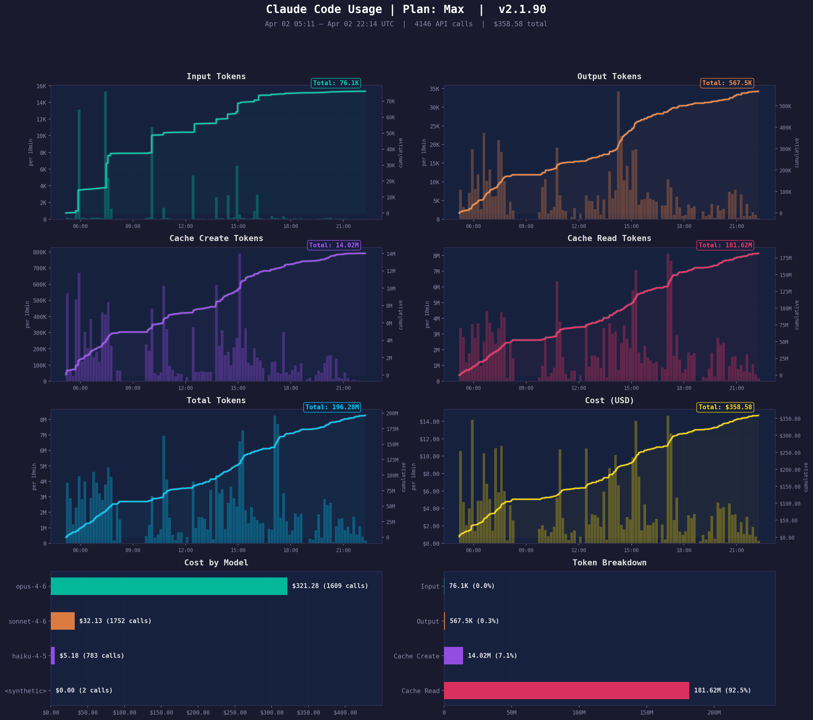

# 📊 ccusage-plot

A dark-themed CLI tool that visualizes your Claude Code token usage and costs by reading local conversation logs (`~/.claude/projects/**/*.jsonl`).



## ⚡ Quick Start

```bash
python3 -m pip install matplotlib && curl -s https://raw.githubusercontent.com/nhz-io/ccusage-plot/main/ccusage_plot.py | python3 - -p 7d --tz PST
```

## 📋 Requirements

- Python 3.9+
- `matplotlib`

```bash
pip install matplotlib
```

## 🚀 Usage

```bash
python ccusage_plot.py [options]
```

### Options

| Flag | Description | Default |
|------|-------------|---------|
| `-p`, `--period` | Time period: `6h`, `3d`, `1w`, `2m`, etc. | `24h` |
| `--all` | Plot all history | off |
| `--from` | Start date: `YYYY-MM-DD` or `YYYY-MM-DD HH:MM` | none |
| `--to` | End date: `YYYY-MM-DD` or `YYYY-MM-DD HH:MM` | none |
| `-o`, `--output` | Output PNG file path | `ccusage_{period}.png` |
| `--tz` | Timezone for x-axis and date parsing (`PST`, `EST`, `UTC`, `Asia/Tokyo`, etc.) | UTC |
| `--highlight` | Highlight a daily time window, e.g. `5-11` or `5:00-11:30` | none |

### 📅 Date Range

You can specify what time window to plot in several ways:

| Flags | Meaning |
|-------|---------|
| *(none)* | Last 24 hours |
| `--all` | All history |
| `-p 7d` | Last 7 days from now |
| `--from 2025-03-20` | From that date to now |
| `--from 2025-03-20 --to 2025-03-28` | Explicit date range |
| `--from 2025-03-20 -p 7d` | 7 days starting from March 20 |
| `--to 2025-03-28 -p 3d` | 3 days ending March 28 |

Dates are parsed in the timezone specified by `--tz` (UTC if omitted).

### Examples

```bash
# Last 24 hours (default)
python ccusage_plot.py

# All history
python ccusage_plot.py --all

# Last 7 days in Pacific time
python ccusage_plot.py -p 7d --tz PST

# Specific date range
python ccusage_plot.py --from 2025-03-20 --to 2025-03-28 --tz EST

# One week starting from a date
python ccusage_plot.py --from 2025-03-20 -p 1w

# Last 2 weeks, highlight working hours, custom output
python ccusage_plot.py -p 2w --tz EST --highlight 9-17 -o usage.png

# Last 3 months
python ccusage_plot.py -p 3m
```

## 🎨 Charts

The output PNG contains 8 panels:

1. **Input Tokens** — per-segment bars + cumulative line
2. **Output Tokens** — per-segment bars + cumulative line
3. **Cache Create Tokens** — per-segment bars + cumulative line
4. **Cache Read Tokens** — per-segment bars + cumulative line
5. **Total Tokens** — per-segment bars + cumulative line
6. **Cost (USD)** — per-segment bars + cumulative line
7. **Cost by Model** — horizontal bar chart with per-model totals
8. **Token Breakdown** — horizontal bar chart by token category

Time segments are auto-sized to maintain consistent bar density (~120 bars), snapping to clean intervals (1min, 5min, 15min, 1h, 4h, 12h, 1d, 1w, 30d).

## 🤖 Supported Models

Cost estimation uses published pricing for:

- Claude Opus 4.6
- Claude Sonnet 4.6
- Claude Haiku 4.5

Unknown models fall back to Sonnet-tier pricing.

## 📄 License

MIT
